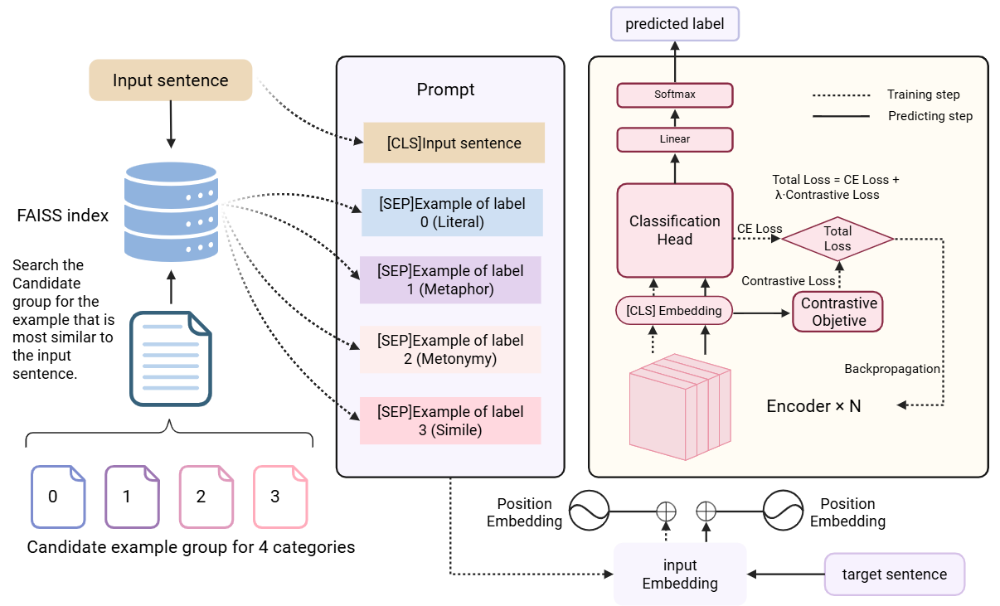

# FLUTE: A Unified Framework for Fine-grained Figurative Language Detection

Official implementation of the paper: **"FLUTE: A Unified Framework for Fine-grained Figurative Language Detection"** (Submitted to ACL 2025).

[](https://opensource.org/licenses/MIT)
[](https://www.python.org/downloads/)
[](https://pytorch.org/)

## 📖 Overview

This repository contains the source code for **FLUTE**, a framework designed for the unified detection of fine-grained figurative language, including **Metaphor**, **Metonymy**, and **Simile**. 

### Key Features
* **Dynamic Prompt Mechanism**: Utilizes semantically retrieved exemplars to provide intuitive analogical signals for the encoder.
* **Supervised Contrastive Learning (SCL)**: Enhances category discrimination by explicitly learning fine-grained class boundaries.

---
### 🖼️ Model Architecture

> *Figure 1: Overview of the FLUTE framework. It consists of (1) Prompt Construction with dynamic exemplars, (2) Encoding with DeBERTa, and (3) Joint Optimization with Cross-Entropy and Supervised Contrastive Loss.*

---

## 🛠️ Installation

```bash
# Clone the repository
git clone https://github.com/LSxianxianxian/FLUTE.git
cd FLUTE

# Install dependencies
pip install -r requirements.txt
```

## 🏃 Quick Start

To train the model with the default configuration (Dynamic Prompts + SCL):

```bash
python run.py \
```
